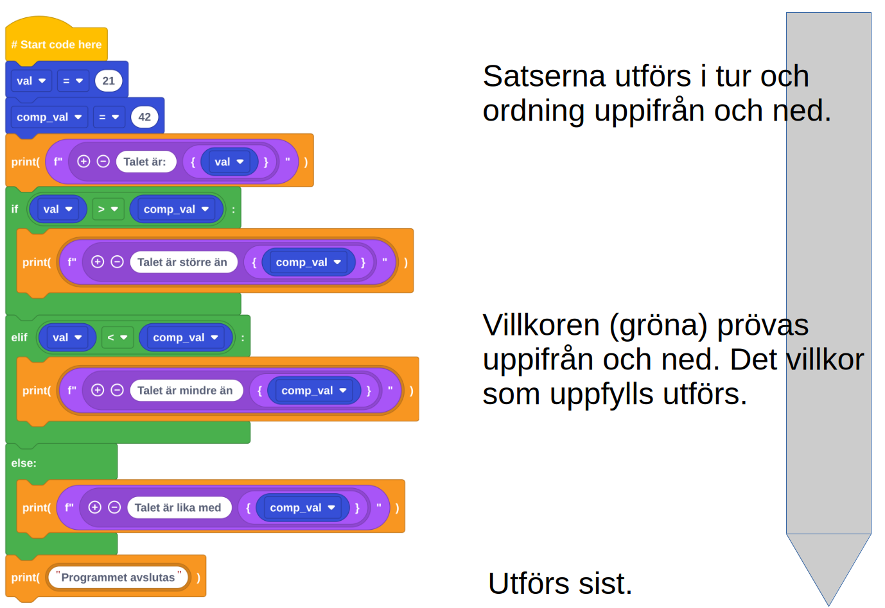

## Introduktionsvideo

<div style="text-align: center;">

</div>

## Förkunskaper?

:::{.double-v-space}
:::

{height=300}

## Blockschema



## Vad är ett datorprogram?

::: {.smaller-font}

:::: {.fragment .fade-in-then-semi-out}
* Ett datorprogram är som en uppsättning instruktioner eller regler som
  berättar för datorn vad den ska göra.
::::

:::: {.fragment .fade-in-then-semi-out}
* Precis som vi människor använder oss av instruktioner för att utföra olika
  uppgifter, använder sig också en dator av programmet för att lösa problem och
  utföra specifika arbetsuppgifter.
::::

:::: {.fragment .fade-in-then-semi-out}
* Dessa instruktioner i ett datorprogram skrivs vanligtvis i ett
  programmeringsspråk, vilket är ett särskilt språk som både människor och
  datorer kan förstå.
::::

:::: {.fragment .fade-in-then-semi-out}
* När programmet körs på en dator läser den stegvis igenom varje instruktion
  och utför de angivna operationerna.
::::
:::

## Vad är ett datorprogram? (forts.)

:::{.smaller-font}

:::: {.fragment .fade-right .fade-in-then-semi-out}
* Genom att kombinera olika instruktionssekvenser kan man bygga upp mer
  komplexa program som kan hantera allt från matematiska beräkningar till
  grafikrendering eller datahantering.
::::

:::: {.fragment .fade-right .fade-in-then-semi-out}
* Människor skapar dessa program för att automatisera processer, lösa problem
  eller utveckla nya teknologier och applikationer som används inom allt från
  spelutveckling till medicinsk forskning och affärsverksamhet.
::::

:::: {.fragment .fade-up}
Sammanfattningsvis kan man säga att ett datorprogram är en samling av
instruktioner skrivna i programmeringsspråk, vilket ger möjlighet att styra hur
en dators hårdvara fungerar och får den att utföra specifika uppgifter.
::::
:::

## Variabler

En variabel är ett "namn" på ett värde. Detta värde kan uppdateras.

<hr>

::: columns
:::: {.column width="55%"}
::::: {.fragment .fade-right fragment-index=1}
"Tänk på ett tal"
:::::

:::::{.v-space}
:::::

::::: {.fragment .fade-right fragment-index=3}
"Dubbla det"
:::::

:::::{.v-space}
:::::

::::: {.fragment .fade-right fragment-index=5}
"Lägg till 5 till resultatet"
:::::
::::

:::: {.column width="45%"}
::::: {.fragment .fade-left fragment-index=2}
`x = 5`
:::::

:::::{.v-space}
:::::

::::: {.fragment .fade-left fragment-index=4}
`x = 2 * x`
:::::

:::::{.v-space}
:::::

::::: {.fragment .fade-left fragment-index=6}
`x = x + 5`
:::::
::::
:::

:::{.v-space}
:::

::: columns
:::: {.column width="55%"}
::::: {.fragment .fade-up fragment-index=7}
___
:::::
::::
:::: {.column width="45%"}

:::::{.fragment .fade-up fragment-index=7}
---
Nu har `x` värdet `15`.
:::::
::::
:::


## Variabeltyper

:::{.v-space}

Några vanliga **typer** av variabler är
<span style="font-size: 90%;"> `int`</span> (heltal),
<span style="font-size: 90%;">`float`</span> (tal med decimaler) och
<span style="font-size: 90%;">`string`</span> (sträng, text).
:::

:::{.v-space}
Exempel:
```{python}
ett_heltal  = 5
ett_flyttal = 2.9
en_sträng   = "En sträng"
```
:::

Stränginnehållet måste omgärdas av citationstecken!
(<span style="font-size: 90%;">`"..."`</span>)
Python är ett **löst typat** språk; variabler kan byta typ under körning.

## Variabler i datorminnet

:::{.blue-bg-small-padding}
När en variabel tilldelas ett värde kommer detta värde att sparas på en plats i
datorns minne. När variabeln adresseras kommer namnet att hänvisa till denna
minnesplats.

<div class="memory-layout">

<div class="variable score">
  `score`
<span class="arrow"></span>
</div>

<div class="variable speed">
  `speed`
<span class="arrow"></span>
</div>

<div class="variable name">
  `name`
<span class="arrow"></span>
</div>

<div class="memory-cells">
<div class="memory-cell">`...`</div>
<div class="memory-cell">`42`</div>
<div class="memory-cell">`5.2`</div>
<div class="memory-cell">`"Alice"`</div>
<div class="memory-cell">`...`</div>
</div>
<div class="address-arrow"></div>
<div class="address-label">Minnesadresser</div>

</div>

:::

## Några regler för variabelnamn

:::{.fragment .fade-right}
* Alla bokstavstecken och siffror får användas
:::

:::{.fragment .fade-right}
* Kan inte börja med en siffra
:::

:::{.fragment .fade-right}
* Kan inte innehålla mellanslag
:::

:::{.fragment .fade-right}
* Kan inte innehålla bindestreck
:::

:::{.fragment .fade-right}
* Python gör skillnad på versaler och gemener (`speed = 42` och `Speed = 42`
  är olika)
:::

## Några regler för variabelnamn (forts.)

:::{.v-space}
:::

:::{.fragment .fade-right}
* Variabelnamn bör inledas med en gemen ("liten") bokstav
:::

:::{.fragment .fade-right}
* Variabelnamn bör vara uttrycksfulla, dvs beskriva vad de står för (t ex
  <span style="font-size: 95%;">`price`</span> respektive <span
  style="font-size: 95%;">`name`</span>)
:::

:::{.fragment .fade-right}
* Ord separeras, t ex<span style="font-size: 95%;"> `first_name =
  "Alice"`</span>
:::

:::{.fragment .fade-right}
:::: {style="background-color: yellow; width: 100%; height: 70px; padding: 10px; margin-top: 20px;"}
[Länk: Tillåtna namn på variabler](https://www.w3schools.com/python/gloss_python_variable_names.asp)
::::
:::

## Övning

::: columns
<!-- Vänster kolumn -->
:::: {.column width="55%"}
::::: {.fragment .fade-in-then-semi-out fragment-index=1}
* Gå in på [app.edublocks.org](https://app.edublocks.org)
* Skapa fem variabelnamn: `namn`, `ålder`, `styrka`, `intresse_1` och
  `intresse_2`
* Ge variablerna värden för att presentera dig själv
* Styrkan ska anges som ett heltal mellan 1 och 10, **men ska i presentationen
  överdrivas med 20 %**
:::::
::::

<!-- Höger kolumn -->
:::: {.column width="45%"}
::::: {.fragment .fade-left fragment-index=2}
::::::{.blue-bg-small-padding}

**Exempel** (variabelvärden i gult)

* Jag heter: <span class="yellow-text">Kalle</span>
* Ålder i år: <span class="yellow-text">17</span>
* Min styrka: <span class="yellow-text">8.4</span>
* Jag gillar <span class="yellow-text">segling</span> och
  <span class="yellow-text">matlagning</span>
::::::
:::::
::::
:::

## Uppgift

* Skapa mappen `Programmering`, som ska ligga under `Dokument` på din dator
  (här ska du organisera dina filer under kursen).

* Ladda ned och installera Pythonmiljön **Thonny** från
  [https://thonny.org/](https://thonny.org/)

* Kopiera koden som skapades från den föregående "block-övningen" till ett
  dokument i Thonny och kör den.

## Det du bör ha med dig efter lektionen

* Kunna definiera ett datorprogram

* Känna till vad en variabel är, hur de bör namnges och känna till några olika
  typer av dessa

* Kunna skriva ut strängar och tal från variabler i EduBlocks

## Kursöversikt

::: columns
:::: {.column width="50%"}

### Hösttermin

::::: {.fragment .fade-in-then-semi-out fragment-index=1}

* Python med EduBlocks,<br>ca 1 vecka
* Grunderna i Pythonkodning, ca 7 veckor
* Några mindre projekt,<br>ca 2x3 veckor
* GitHub
* Övrigt innehåll enl. kursplan
:::::
::::
:::: {.column width="45%"}

### Vårtermin

::::: {.fragment .fade-right fragment-index=2}
* Några övriga pythonkoncept och algoritmer
* JavaScript, grafiskt innehåll i webbläsare
* Projekt
:::::
::::
:::

## Några riktlinjer och tips

:::{.smaller-font}
* När vi kodar Python så görs det i Thonny

::::{.fragment .fade-in fragment-index=1}
* Vi använder inte AI för att generera kod
::::
::::{.fragment .fade-in fragment-index=2}
* Vi kan däremot fråga AI om varför kod inte fungerar som tänkt
::::
::::{.fragment .fade-in fragment-index=3}
* Koda gärna tillsammans
::::
::::{.fragment .fade-in fragment-index=4}
* Att kunna skriva kod börjar ofta med att läsa kod
::::
::::{.fragment .fade-in fragment-index=5}
* Dela upp problem i mindre problem, som i sin tur delas upp i ännu mindre
  problem, osv
::::
:::

